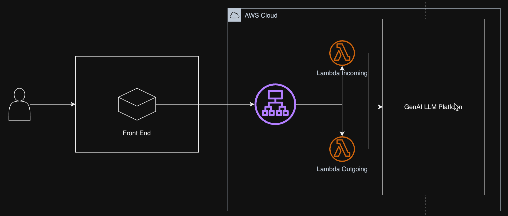

# End User Client Integration

## Architecture



## How to integrate
1. Get endpoint from ALB that start with `unicorn-gym-alb`
2. Use `endpoint/in` to send chat
3. Use `endpoint/out` to receive response chat (asynchronous/poll)
4. Send payload that follow below format to start conversation and to get the response

## Payload format
### Send Chat
- Request
```
{
   "arguments":{
      "data":"{\"action\":\"run\",\"modelInterface\":\"langchain\",\"data\":{\"mode\":\"chain\",\"text\":\"what is capital city of indonesia?\",\"files\":[],\"modelName\":\"meta-LLama3-1-8b-instruct\",\"provider\":\"sagemaker\",\"sessionId\":\"e57f887e-1ac1-4fb7-9478-bfb666a00e3g\",\"workspaceId\":\"\",\"modelKwargs\":{\"streaming\":true,\"maxTokens\":512,\"temperature\":0.6,\"topP\":0.9}}}"
   },
   "identity":{
      "claims":{
         "origin_jti":"d2fcf5a4-8618-417a-9a20-23b460c37a74",
         "sub":"91192d26-7031-7069-06eb-8ed870233366",
         "event_id":"92979d5c-74ce-45c6-9083-f8efa5b2145e",
         "token_use":"access",
         "scope":"aws.cognito.signin.user.admin",
         "auth_time":1733311963,
         "iss":"https://cognito-idp.ap-southeast-3.amazonaws.com/ap-southeast-3_fnfVKFryQ",
         "exp":1733366959,
         "iat":1733363359,
         "client_id":"56mo66skn061vgpqj8mg154g5h",
         "jti":"11fad042-eca9-4eba-b395-868bf5860ee3",
         "username":"91192d26-7031-7069-06eb-8ed870233366"
      },
      "defaultAuthStrategy":"ALLOW",
      "groups":null,
      "issuer":"https://cognito-idp.ap-southeast-3.amazonaws.com/ap-southeast-3_fnfVKFryQ",
      "sourceIp":[
         "103.157.191.155"
      ],
      "sub":"91192d26-7031-7069-06eb-8ed870233366",
      "username":"91192d26-7031-7069-06eb-8ed870233366"
   }
}
```
- Response
```
{
   "MessageId":"ce650311-098b-543e-b22e-5cdd7d0513ac",
   "ResponseMetadata":{
      "RequestId":"281fb7bd-2f86-5763-a64d-e8715b08a0f1",
      "HTTPStatusCode":200,
      "HTTPHeaders":{
         "x-amzn-requestid":"281fb7bd-2f86-5763-a64d-e8715b08a0f1",
         "date":"Fri, 06 Dec 2024 03:41:02 GMT",
         "content-type":"text/xml",
         "content-length":"294",
         "connection":"keep-alive"
      },
      "RetryAttempts":0
   }
}
```
Please note important field: `argument.data.sessionId` and `identity.username`
### Incoming response for poll
- Request
```
{"userId":"unicorn","sessionId":"e57f887e-1ac1-4fb7-9478-bfb666a00e3g"}
```
- Response
```
{"AI": "\n\nThe capital city of Indonesia is Jakarta. It is located on the northwest coast of Java Island."}
```