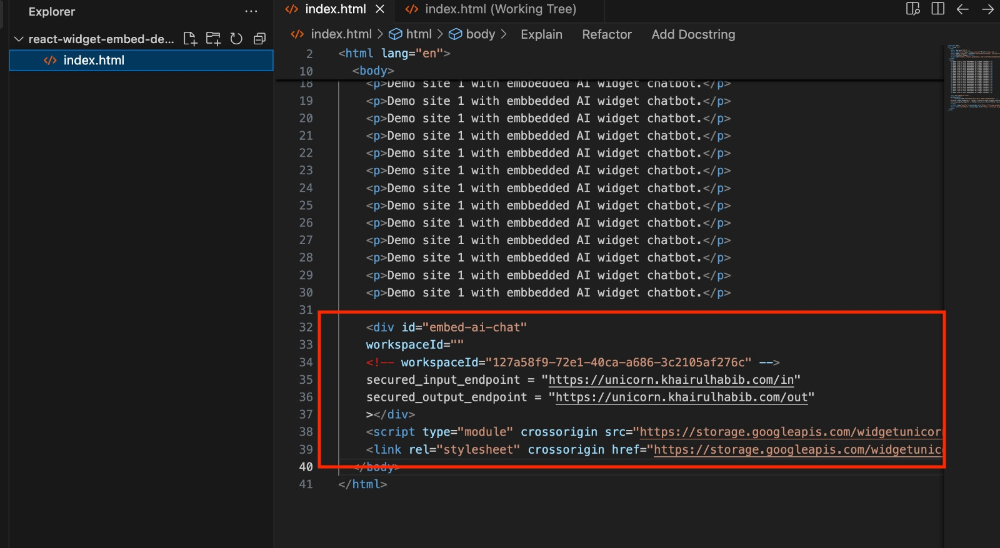

# Changes to the baseline repository #

During the unicorn gym we are making several changes to the baseline repository to make the solutions more extensible and can utilize newer models available in Sagemaker Jumpstart and HuggingFace. 
This will benefit regions who does not have Bedrock yet and to showcase to customer who must use in country services.

We also add separate endpoint for client application to consume the Gen AI APIs for users that prefer not to use Cognito user pool.

## Deployable in Jakarta region
As of now (Dec 2024), [baseline repo](https://github.com/aws-samples/aws-genai-llm-chatbot) can't be deployed to Jakarta region.

Necessary changes, including in the dependency libraries, are made to make it deployable in Jakarta region.


## Model Selection
As of now (Dec 2024), in [baseline repo](https://github.com/aws-samples/aws-genai-llm-chatbot) support several Sagemaker model deployments. but it's not actively maintained. i.e. Llama 2 is supported, but Llama 3 can't be deploy.
Any new models to be added, code change needed in this [file](https://github.com/aws-samples/aws-genai-llm-chatbot/blob/main/lib/models/index.ts).

In order to make the solution able to adapt new models easily we decide to externalize both HuggingFace model configurations and Sagemaker JumpStart model configurations to `config.json` located in `aws-genai-llm-chatbot/bin`

sample configuration in `config.json`
```text
"sagemaker": [
      {
        "name": "SeaLLMs_v3_7B_Chat",
        "huggingface": {
          "modelId": "SeaLLMs/SeaLLMs-v3-7B-Chat",
          "container": {
            "repositoryName": "huggingface-pytorch-tgi-inference",
            "tag": "2.3.0-tgi2.2.0-gpu-py310-cu121-ubuntu22.04"
          }
        },
        "instanceType": "ml.g5.2xlarge",
        "startupHealthCheckTimeoutInSeconds": 300,
        "environments": {
          "SM_NUM_GPUS": "1"
        }
      },
      {
        "name": "LLamaV3_1_8B_Instruct",
        "endpointName": "meta-LLama3-1-8b-instruct",
        "jumpstart": {
          "model": "META_TEXTGENERATION_LLAMA_3_1_8B_INSTRUCT_2_1_0"
        },
        "instanceType": "ml.g5.4xlarge"
      },
      {
        "name": "Llama3_8B_sahabatai_v1_instruct",
        "huggingface": {
          "modelId": "GoToCompany/llama3-8b-cpt-sahabatai-v1-instruct",
          "container": {
            "repositoryName": "huggingface-pytorch-tgi-inference",
            "tag": "2.4.0-tgi2.4.0-gpu-py311-cu124-ubuntu22.04"
          }
        },
        "instanceType": "ml.g5.2xlarge",
        "startupHealthCheckTimeoutInSeconds": 300,
        "environments": {
          "SM_NUM_GPUS": "1",
          "MAX_INPUT_LENGTH": "1024",
          "MAX_BATCH_PREFILL_TOKENS": "2048",
          "MAX_BATCH_TOTAL_TOKENS": "8192"
        }
      }
    ]
```


Benefits:
* Allow adding new sagemaker model deployment via config file without code change. 
* No need to rebuild code.

Remarks:
* Still need to redeploy the solutions every time we add or remove models from the configuration file.
* JumpStart model deployment still depends on `enum` in internal library which is not always up-to-date. Hence, you might not be able to deploy latest model in JumpStart. However, you can deploy same model as long as it's available in HuggingFace.


## Prompt Template Management
As of now (Dec 2024), in [baseline repo](https://github.com/aws-samples/aws-genai-llm-chatbot), template for `prompt`, `prompt Q&A`, and `prompt condensed Q&A` are hardcoded for every model adapter.

We improve the implementation so admin are allows to configure those templates from DynamoDB. Prompt templates update are applied without any code rebuilding and redeployment.


## New Endpoint for Gen AI API to be Consumed by Client App
Existing endpoint does not separate between Admin UI and user UI so only have single endpoint that enforce the use Cognito user pool for authentication and use of Amplify for client application.
We are adding a second endpoint that can be utilized by user who wants to have their own authentication mechanism for user UI
The new endpoint is using common REST API that currently is easier to adopt. The trade off is this solution will not support streaming output

## New Client Application Chat Widget
We are adding reference implementation client app chat widget that will connect to the new endpoint.

Add code snippet in your client application HTML

The chat widget will connect you the Gen AI APIs


## Architecture Changes

In the following diagram, new components are light red rectangles, changed components are light green rectangles and existing components are using white rectangle 


UI for enduser will connect to Load Balancer that will forward to two Lambda, Lambda Incoming and Lambda Outgoing). Lambda incoming will connect to SNS then SQS, bypassing the Appsync and Lambda Resolver for Admin UI. This changes enables clent app to use other authentication than Cognito user pool.
Existing lambda langchain is modified to externalize the configuration of Sagemaker Jumpstart and HuggingFace models to configuration files.
Another changes is providing DynamoDB to store prompt template.


